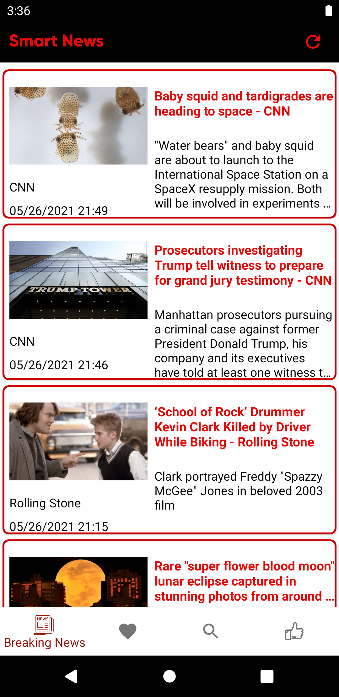

# Smart News
> A Smart News application developed in Kotlin

## Table of contents
* [General info](#general-info)
* [Architecture Diagram](#architecture-diagram)
* [Components](#components)
* [Installation](#installation)
* [Screenshots](#screenshots)
* [Contributors](#contributors)
* [Status](#status)

## General info

SmartNews is a news app that allows users to read news easily on their mobile device. Currently built for Android in Kotlin, it has multiple features such as news recommendation, news search, and bookmarking user’s favorite news for them to read later.

## Architecture Diagram

## Components

The project is built in Kotlin, and is structured in an MVVM format. The ViewModel holds the data so that when the activity fragment is recreated, then the data is not recreated as well, conforming to the MVVM architecture. We use Retrofit, which turns our HTTP API calls from NewsAPI into requests that will be shown in the Activity Fragment class. We also implement LiveData binding, which allows our application to be lifecycle aware and notify UI of any changes in data. For the activity fragment, we have a main page where we implement RecyclerView for scrollable content, and then on click to the news app we can see the detailed view where we can actually read the article in full.  On the navigation tab at the bottom, we have 4 tabs: Breaking News (MainActivity), Saved News, Search News, and Recommended News. Users can click on each one to enjoy their functionalities. When we go into the detailed view, we set up a NavBar which contains the title of the article and an up button, which can take us back to the MainActivity fragment.

Here are the main components:
- MVVM Model
- Retrofit
- RecyclerView
- LiveData
- NewsAPI
- Glide by BumpTech

## Installation

To Setup the project on Android Studio, we recommend using the newest version of Android Studio, which currently, is Android 4.2.1 to Windows. For this project, it is also recommended that your locale has Java 11 installed; when Java 8 was the only JDK in the build configuration, the build console returned an error. Then after installing the Android studio Version, make sure that the ADB emulator is set up correctly too so you can preview that application. From the GitHub link below, you can clone the project to your directory. Sync the gradle under the module and app gradle, which will download the dependencies requirements, and then click build app. When it says gradle invocation finished with 0 errors, then you can click run app, which will launch the app on the ADB emulator.

## Screenshots

## Contributors

| Team Trinity               | GitHub Repositories                           |
|----------------------------|-----------------------------------------------|
| Archana Shokeen (015237378)| https://github.com/archanashokeeniitg/NewsApp |
| Eric Cheng (015300506)     | https://github.com/eccx400/NewsApp-1          |
| Hung Le (010306088)        | https://github.com/HungVLe/NewsApp            |

## Technologies

- Android Studio 14.2.0
- Java 11.0.11 JDK
- ADB Emulator 

## Status
Project is: _Completed_
